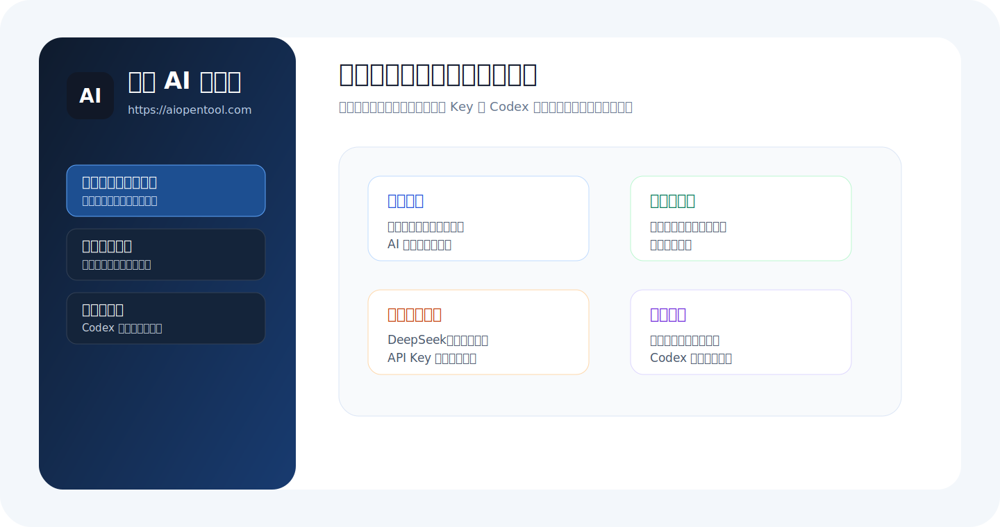
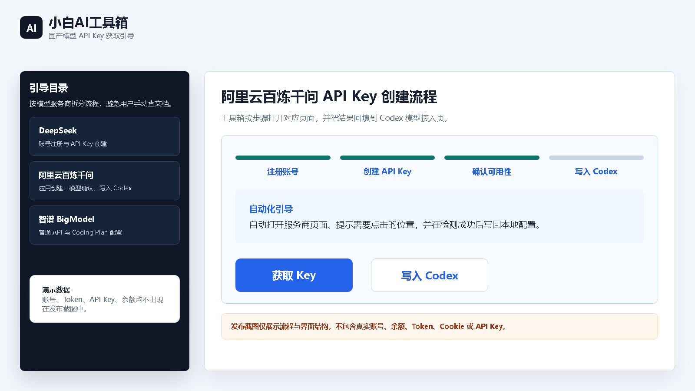
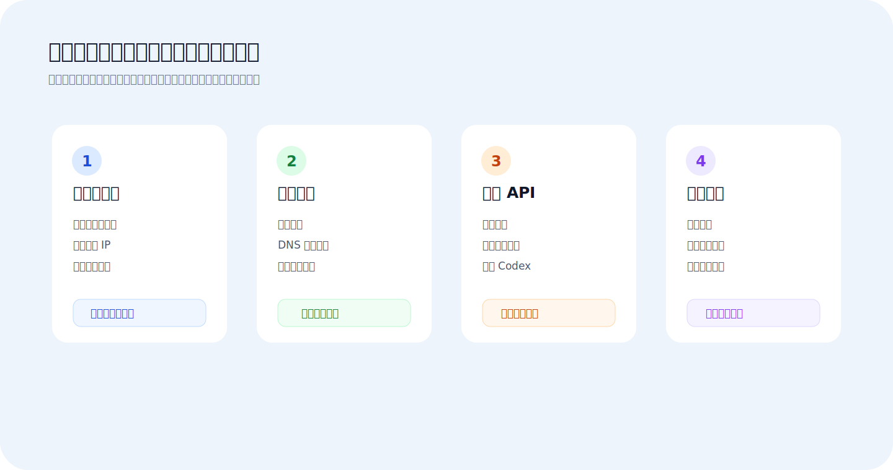

# 小白 AI 工具箱

小白 AI 工具箱是 AiOpenTool 维护的 Windows 桌面辅助工具，面向“会使用 AI，但不熟悉服务器、域名、备案、模型 API 和 Codex 配置”的用户。

它不是单纯的网页收藏夹，而是一个本地引导中枢：打开对应页面、识别流程状态、保存用户确认后的本地配置，并和 codex汉化增强版联动，把国产模型、Codex 账号、部署流程和问答站答案串起来。

## 软件界面

## 主要能力

### 后台部署自动化工具

适合“不知道服务器怎么买、买完怎么给 AI 部署、端口怎么开”的用户。

- 引导购买或更换腾讯云轻量服务器。
- 保存服务器公网 IP、地域、到期时间等信息。
- 按 AI 部署协议识别需要开放的公网端口。
- 协助处理防火墙放行、部署前检查、服务器状态读取。
- 支持域名购买、域名解析、域名映射、备案入口和到期提醒。

工具箱只做引导和自动化准备，不替用户付款、不替用户提交订单、不做不可逆云资源操作。

### 热门辅助工具

适合“Codex 登录、Plus 充值、验证码、国产模型开户”等高频问题。

- 聚合 AiOpenTool 问答站中的常见问题和解决方案。
- 按场景展示可点击入口，例如 Codex 安装、注册、充值、国产模型开户。
- DeepSeek、阿里千问、智谱 GLM 的 API Key 获取流程分平台处理。
- 登录、实名、充值、付款等动作保留给用户确认。

### 国产模型开户与写入 Codex

适合“想在 Codex 里使用 DeepSeek、千问、智谱，但不知道 Key 去哪申请”的用户。

- 打开对应平台的官方 API Key 页面。
- 辅助识别和保存 API Key。
- API Key 本地加密保存。
- 支持把 Key 写入 codex汉化增强版。
- 配合 Codex 侧刷新模型列表，让用户尽量通过下拉选择模型，而不是手填模型名。

支持的主要平台：

- DeepSeek
- 阿里云百炼千问
- 智谱 BigModel / GLM

### Codex 多账号切换

适合多个 Codex 原生账号之间切换使用。

- 展示账号列表、套餐类型、5 小时额度、周额度。
- 支持刷新单个账号额度和批量刷新。
- 支持切换目标账号并重启桌面 Codex。
- 可勾选同步到 VS Code Codex 插件，把目标账号同步为全局登录状态，并自动备份原登录状态。
- 只在 codex汉化增强版当前模型来源为 Codex / OpenAI 原生模型时显示。

### 小白社区与上下文推荐

适合把常见问题沉淀为可复用答案。

- 对接 AiOpenTool 问答站。
- 根据 Codex 对话中的关键上下文推荐相关标签答案。
- 如果命中部署、域名、备案等强引导场景，优先打开工具箱引导。
- 如果只是普通问答站标签命中，则以 AiOpenTool 名义推荐已有回答并跳转帖子。

## 和 codex汉化增强版的关系

- codex汉化增强版负责在桌面 Codex 中显示中文配置、模型入口、推荐卡片和本地桥接能力。
- 小白 AI 工具箱负责具体引导：服务器、域名、备案、模型 Key、账号切换、社区答案。
- 两者通过本地 HTTP 接口协作。
- 小白工具箱保存登录态、模型 Key、云平台信息和引导状态；Codex 侧负责调用和展示入口。

## 安全边界

- 不自动付款。
- 不自动提交实名、备案、订单或充值。
- 不自动删除、重置、销毁服务器和云资源。
- API Key、服务器凭据、云平台密钥等敏感信息本地加密保存。
- 工具箱会尽量把风险动作留给用户自己确认。

## 发布包说明

正式发布包是已经编译好的 Windows 安装包，用户不需要 Go、Node、NSIS 等构建环境。

正式版本号使用 SemVer，GitHub Release tag、安装包版本、校验信息和 manifest 版本必须一致。

GitHub Release 中面向用户的是预编译 Windows 安装包，配套校验信息和版本元数据会随发布一起提供。用户不需要下载源码，也不需要在本机编译。

自动更新服务会读取本仓库最新正式版本，并同步到小白工具箱更新通道。客户端按版本号判断是否需要更新。

## 维护方

维护方：AiOpenTool  
站点：https://www.aiopentool.com/
